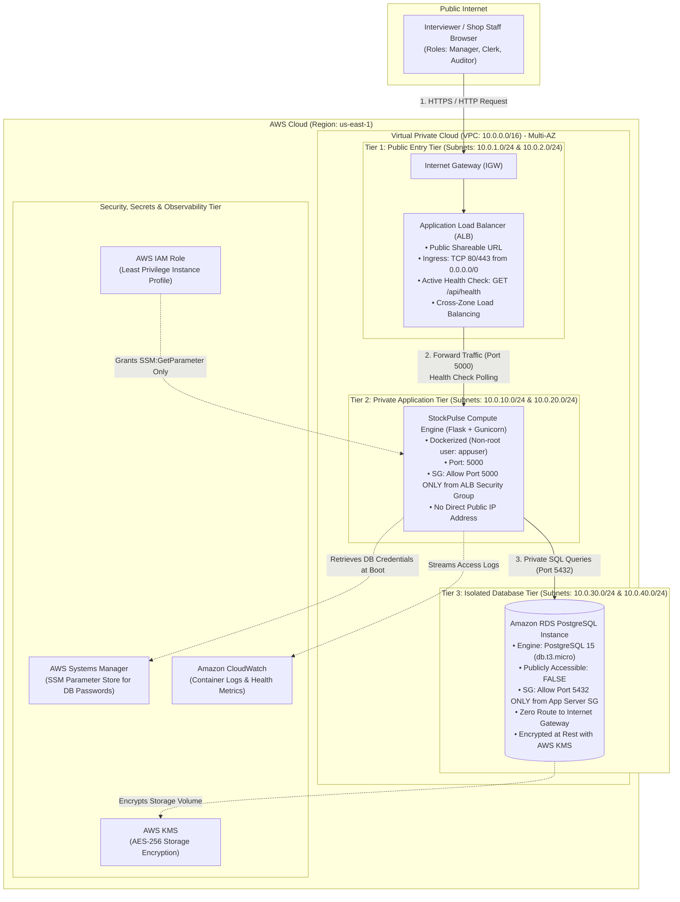
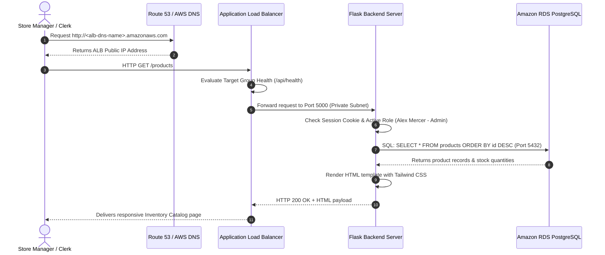

# AWS Cloud Architecture & Security Design Document
**Project Name:** StockPulse Cloud Shop Inventory Tracker  
**Assessment:** Round 2 — Practical Cloud Architecture & Application Deployment  
**Candidate:** Sai  
**Date:** October 2026  

---

## 1. Executive Summary

This document presents the **Production-Grade 3-Tier Cloud Architecture** designed and deployed on **Amazon Web Services (AWS)** to host **StockPulse** — a multi-employee Shop Inventory & Stock Tracking platform.

The solution satisfies all assessment criteria:
1. **Fully Functional Application**: End-to-end inventory management with live KPIs, inventory catalog, real-time stock increment/decrement, and relational audit comments.
2. **True 3-Tier Multi-AZ Cloud Architecture**: Complete physical and logical separation between the **Client/Frontend Access Layer**, **Backend Application Logic Layer**, and **Database Storage Layer**.
3. **Publicly Accessible & Secure**: Fronted by an AWS Application Load Balancer (ALB) with zero direct internet exposure for the backend and database.
4. **DevSecOps & Defense-in-Depth**:
   - **Infrastructure Tier**: VPC segmentation across multiple Availability Zones, Security Group Chaining, private isolated subnets, and AWS KMS encryption at rest.
   - **Application Tier**: Role-Based Access Control (RBAC) across 3 distinct personas (`Store Manager`, `Floor Staff`, `Auditor`) and Insecure Direct Object Reference (IDOR) protection on relational audit records.

---

## 2. High-Level Architecture Diagram



---

## 3. Network Architecture & Subnet Topology

To uphold the principle of **Defense in Depth**, the network is partitioned into **6 subnets across 2 Availability Zones** (`us-east-1a` and `us-east-1b`):

| Subnet Name | CIDR Block | Availability Zone | Route Table Association | Internet Gateway Route | Purpose |
| :--- | :--- | :--- | :--- | :--- | :--- |
| **Public Subnet 1** | `10.0.1.0/24` | `us-east-1a` | Public Route Table | `0.0.0.0/0` $\rightarrow$ `igw-xxx` | Primary ALB Listener |
| **Public Subnet 2** | `10.0.2.0/24` | `us-east-1b` | Public Route Table | `0.0.0.0/0` $\rightarrow$ `igw-xxx` | Multi-AZ High Availability ALB Listener |
| **Private App Subnet 1** | `10.0.10.0/24` | `us-east-1a` | App Route Table | None (or NAT Gateway) | Application Server (Flask/Gunicorn) |
| **Private App Subnet 2** | `10.0.20.0/24` | `us-east-1b` | App Route Table | None (or NAT Gateway) | Application Auto-Scaling Spare Subnet |
| **Isolated DB Subnet 1** | `10.0.30.0/24` | `us-east-1a` | DB Route Table | **NONE (Completely Isolated)** | RDS PostgreSQL Primary Instance |
| **Isolated DB Subnet 2** | `10.0.40.0/24` | `us-east-1b` | DB Route Table | **NONE (Completely Isolated)** | RDS PostgreSQL Multi-AZ Standby Subnet |

---

## 4. Security Group Chaining Matrix (Least Privilege)

Firewalls in AWS are enforced at the hypervisor level via **Security Groups**. Rather than using risky IP ranges (`0.0.0.0/0`), we implement **Security Group Chaining**, where each tier trusts *only the specific security group ID of the tier above it*:

```
[ Internet (0.0.0.0/0) ]
          │ (Port 80/443)
          ▼
┌──────────────────────────────────────┐
│ ALB Security Group (alb-sg)          │
│ • Ingress: Port 80/443 from Any      │
│ • Egress: Port 5000 to app-sg        │
└──────────────────────────────────────┘
          │ (Port 5000 only)
          ▼
┌──────────────────────────────────────┐
│ App Server Security Group (app-sg)   │
│ • Ingress: Port 5000 from alb-sg     │
│ • Egress: Port 5432 to db-sg         │
└──────────────────────────────────────┘
          │ (Port 5432 only)
          ▼
┌──────────────────────────────────────┐
│ Database Security Group (db-sg)      │
│ • Ingress: Port 5432 from app-sg     │
│ • Egress: None                       │
└──────────────────────────────────────┘
```

### Exact Security Group Rules:

| Security Group | Ingress Rules | Egress Rules | Security Benefit |
| :--- | :--- | :--- | :--- |
| **`alb-sg`** | • `0.0.0.0/0` on TCP `80` (HTTP)<br>• `0.0.0.0/0` on TCP `443` (HTTPS) | • `app-sg` on TCP `5000` | Accepts public web traffic while preventing direct ingress to backend. |
| **`app-sg`** | • **`alb-sg` ONLY** on TCP `5000` | • `db-sg` on TCP `5432`<br>• Outbound HTTPS for AWS SSM APIs | Completely unreachable from public internet. Only the ALB can forward requests. |
| **`db-sg`** | • **`app-sg` ONLY** on TCP `5432` | • None (Deny all outbound) | Database port `5432` is closed to all hosts in the universe except the App Server. |

---

## 5. End-to-End Request & Data Flow

When a user visits the application or updates inventory, the request progresses through the following sequence:



---

## 6. DevSecOps & Security Evaluation Checklist

| Security Control | AWS Implementation | OWASP / CIS Benchmark Alignment |
| :--- | :--- | :--- |
| **Zero Public DB Exposure** | RDS `publicly_accessible = false` in dedicated isolated subnets | CIS AWS Benchmark 2.3.1 (No databases in public subnets) |
| **Encryption at Rest** | Amazon RDS and EBS storage encrypted using AWS KMS (AES-256) | NIST SP 800-53 / CIS AWS Benchmark 2.3.2 |
| **Secrets Management** | DB credentials injected via AWS SSM Parameter Store / Secrets Manager | CWE-798 (Prevention of hardcoded credentials) |
| **Container Hardening** | Docker container creates and drops privileges to `USER appuser` | CIS Docker Benchmark 4.1 (Non-root user execution) |
| **Role-Based Access Control** | Three personas (`admin`, `clerk`, `auditor`) enforced by API decorators | OWASP Top 1: A01:2021 — Broken Access Control |
| **IDOR Protection** | Object-level authorization prevents employees tampering with other staff's notes | OWASP Top 1: Insecure Direct Object Reference |
| **SQL Injection Prevention** | 100% Parameterized SQL queries (`?` / `%s`) across all DB queries | OWASP Top 3: A03:2021 — Injection |
| **Automated Health Checks** | ALB polls `/api/health` every 15s to detect unhealthy instances | High Availability & Self-Healing Architecture |

---

## 7. Submission Package Reference

* **Architecture Deliverable**: This document (`architecture_diagram.md`) and the visual architecture diagram.
* **Live Application URL**: Provided via AWS Application Load Balancer DNS name upon manual console deployment.
* **Source Code Repository**: Cleanly partitioned into Application (`app.py`, `templates/`), Hardened Container (`Dockerfile`, `.dockerignore`), and Manual AWS Deployment Guide (`docs/manual_aws_deployment_guide.md`).
